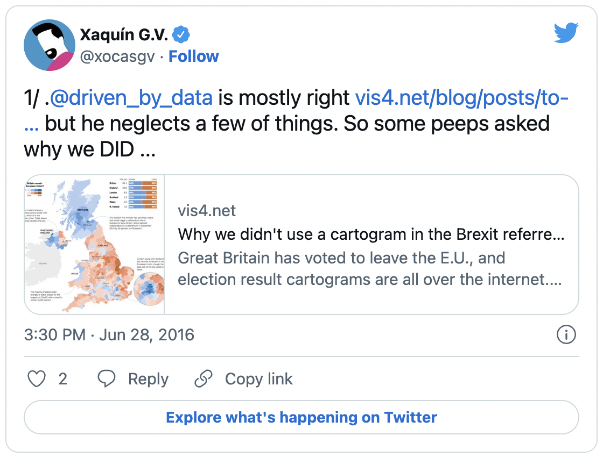

# Design
Should we open our Figma file to everyone that wants a peak? You can explore [Figma file here](https://www.figma.com/file/majnnQyQupv1DO3rtgAtJP/UNEP-Air-Pollution-Action-Note?node-id=0%3A1)


## Demers, tile grid maps and an Indian dessert
- [ ] Readibility improvements on the marks with borders
- [ ] Slides from the SIGLibre presentation

To start, I guess it's important to confess that we love cartograms. We're a bit biased. And we've used them maaaaany times in the past.

[IMAGE OF FAVORITE CARTOGRAMS]

We've even gotten as far as to fight a hero of ours on twitter. Full thread here: [1](https://twitter.com/xocasgv/status/747784201412370432), [2](https://twitter.com/xocasgv/status/747784391909269506), [3](https://twitter.com/xocasgv/status/747784639440248832), [4](https://twitter.com/xocasgv/status/747784881908776960), [5](https://twitter.com/xocasgv/status/747785136951857152), [6](https://twitter.com/xocasgv/status/747785410273652737), [7](https://twitter.com/xocasgv/status/747785637554577409), [8](https://twitter.com/xocasgv/status/747785902852706309), [9](https://twitter.com/xocasgv/status/747786142414573569), [10](https://twitter.com/xocasgv/status/747786388548943872) 



Anyway ... 

We decided on this type of visualization, Demers or square cartograms, out of a set of design restrictions and data nuances that we discuss here. We are working on a paper evaluating Demers cartograms and explaining a soon-to-be-open-sourced in-house tool that we develop to simplify their production.

There's some research on how effective cartograms are to compare, locate, find the biggest values, or see the big picture ... But mostly folks have looked into Dorling and continuous cartograms. One particular study highlighted that Dorling cartograms not only perform well, but they're also subjectively appreciated by audiences who see them as helpful, easy to use, and innovative. Given the similarities between Dorling and Demers cartograms, we have assumed they perform similarly until we complete our current research.

The goals of the visualizations were to:
- [x] Minimize any issues with international borders
- [x] Summarize the big trends
- [x] Depict the data accurately
- [x] Adapt to different types of data while preserving the integrity of the visualization
- [x] Present the data in an engaging manner

Demers cartograms ticked those boxes.

To generate them, we used *Barfi*, our in-house interactive tool. *Barfi* is a fudge-like Indian dessert usually cut in squares. @mattosborn's original name for the tool was 'fdg' (as in force-directed graph), which sounded like 'fudge'. 🔥 imaginative branding here ...

You can read about the tool and how it was born [here](tktkt). But, in a nutshell:  

> Taking these restrictions into account, we decided to opt for two types of grammatically related  visualizations: tile grid maps and Demers cartograms (Bortins et al., 2002).
> 
> In tile grid maps, admin divisions become cells arranged on a grid that fits their geographic layout. Each cell allows multiple possibilities: a class can be displayed by color, a line plot to show a time trend, a histogram > to show a statistical distribution, or a broken bar to show parts of a total.
> 
> In Demers cartograms, admin units are visually coded as squares and geography is approximated. The visual mark, the square in this case, allows you to encode a numerical variable through area and a categorical variable through color.
> 
> Another advantage of this design solution is the use of the same visual mark, in this case squares, which allows us to create transitions between maps that facilitate a fluid sequential narrative.

You can see us [talking about it at the SIGLibre conference](http://diobma.udg.edu/handle/10256.1/6776) — for the *Nth* time, I swear we are planning to open it up once our to-do list is ... well ... done.

## Color scales
- [ ] Inclusive color in dataviz
- [ ] Chroma.js
- [ ] Viz palette reports

## Interaction design
The Note is designed as a stack of information blocks, each composed of a data-driven header, an interactive visualization, and a few paragraphs that contextualize the data and the segment. You can scroll through, perusing the page and stopping whenever a fact or a visual catches your attention, or jump to a specific section of interest from the sticky menu.

[IMAGE OF THE BLOCKS]

Every data point has an annotation, and you can interact with it through your keyboard, click, or hover —depending on the device and technology you use. You can filter the view if you hover or click or tab on the legend, to isolate the specific groupings it represents: select the dark purple in the current state cartogram to see countries with higher levels of exposure, or the blue in the policy actions tile grid map to see who's met the most targets.

We've tried to keep the interaction to a minimum and as effortless as possible. 

Like anatomy? The insides 🔪🧠🫀🫁😱 of our cartogram component look like this.

````svelte
<div class="countries"
  role="graphics-document"
  aria-label={title}>
  {#each cartogramData as d (d.code)}
    {#if d.x && d.y}
      <div
        class="country {classesFn(d).join(' ')}"
        style={calcStyle(d)}
        data-code={d.code}
        tabindex="0"
        role="graphics-object"
        on:mouseenter={(evt) => onMouseEnterCountry(evt, d)}
        on:mouseleave={() => onMouseLeaveCountry()}
        on:focus={() => onMouseClick(d)}
        on:blur={() => onMouseLeaveCountry()}
      >
      <desc>{hoverTextFn(d)}</desc>
      {#if !hideLabels && d.width > 100}
        <span class="country-text">{d.short}</span>
      {/if}
      </div>
    {/if}
  {/each}
</div>
````

## Icon design

